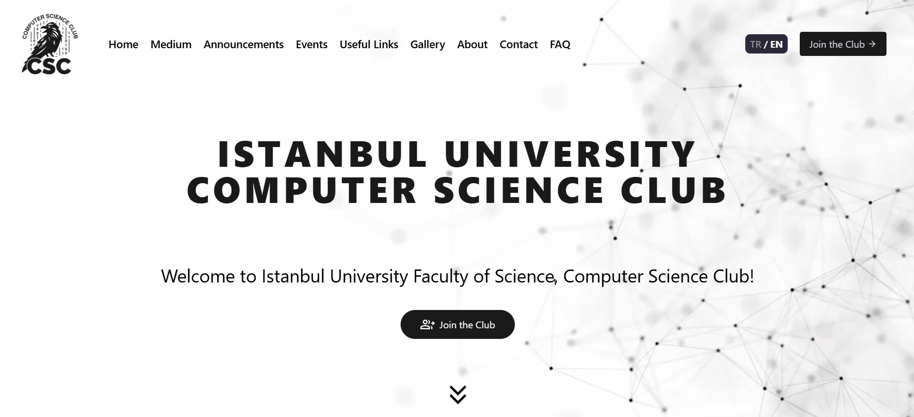

# University Student Club Website

This project is the Istanbul University Computer Science Student Club website. It is designed to provide students with information about the club and facilitate participation in club activities.

## Table of Contents

- [Directory Structure](#directory-structure)
- [Features](#features)
- [Technologies Used](#technologies-used)
- [Getting Started](#getting-started)
  - [Prerequisites](#prerequisites)
  - [Installation](#installation)
    - [Using Docker](#using-docker)
    - [Manual Installation](#manual-installation)
  - [Development Server](#development-server)
  - [Production Deployment](#production-deployment)
    - [Building the Project](#building-the-project)
    - [Starting the Production Server](#starting-the-production-server)
    - [Demo](#demo)
- [Contributing](#contributing)
- [License](#license)

## Directory Structure

```plaintext
Directory structure:
└── enesbuyuk-university-student-club-website/
    ├── messages/
    │   ├── en.json
    │   └── tr.json
    ├── .eslintrc.json
    ├── public/
    │   ├── uploads/
    │   │   └── .gitkeep
    │   ├── robots.txt
    │   └── theme/
    │       ├── default-image.webp
    │       └── videoplayback.webm
    ├── next.config.ts
    ├── package.json
    ├── default.env
    ├── postcss.config.mjs
    ├── Dockerfile
    ├── tailwind.config.ts
    ├── LICENSE
    ├── tsconfig.json
    ├── README.md
    ├── docker-compose.yml
    ├── db/
    │   └── university-student-club.announcements.json
    └── src/
        ├── middleware.ts
        ├── components/
        │   ├── PageLayout.tsx
        │   ├── IndexPageSectionLayout.tsx
        │   ├── MediumArticles.tsx
        │   ├── Gallery.tsx
        │   ├── BaseLayout.tsx
        │   ├── Header.tsx
        │   ├── Navbar.tsx
        │   ├── Footer.tsx
        │   ├── Faq.tsx
        │   ├── LanguageSwitcher.tsx
        │   └── LastEvents.tsx
        ├── i18n/
        │   ├── request.ts
        │   └── routing.ts
        ├── utils/
        │   └── startMongo.ts
        ├── app/
        │   ├── api/
        │   │   ├── events/
        │   │   │   └── route.ts
        │   │   └── announcements/
        │   │       └── route.ts
        │   ├── page.tsx
        │   ├── Inter.ttf
        │   ├── globals.css
        │   ├── [locale]/
        │   │   ├── useful-links/
        │   │   │   └── page.tsx
        │   │   ├── join-the-club/
        │   │   │   └── page.tsx
        │   │   ├── page.tsx
        │   │   ├── gallery/
        │   │   │   └── page.tsx
        │   │   ├── [...rest]/
        │   │   │   └── page.tsx
        │   │   ├── opengraph-image.tsx
        │   │   ├── events/
        │   │   │   └── page.tsx
        │   │   ├── faq/
        │   │   │   └── page.tsx
        │   │   ├── contact/
        │   │   │   └── page.tsx
        │   │   ├── about/
        │   │   │   ├── page.tsx
        │   │   │   ├── charter/
        │   │   │   │   └── page.tsx
        │   │   │   └── team/
        │   │   │       └── page.tsx
        │   │   ├── layout.tsx
        │   │   ├── not-found.tsx
        │   │   └── announcements/
        │   │       └── page.tsx
        │   ├── fonts/
        │   │   ├── GeistMonoVF.woff
        │   │   └── GeistVF.woff
        │   └── layout.tsx
        └── types/
            └── Announcement.ts
```


## Features

- Information about the club
- Membership registration
- News and updates
- Announcements
- Medium articles
- Gallery
- Team page
- Contact form

## Technologies Used

- TypeScript
- JavaScript
- React
- Next.js
- Tailwind CSS
- npm
- Docker

## Getting Started

First, rename the `default.env` file to `.env` and fill in the variables according to your setup.

### Prerequisites

Make sure you have Node.js and npm installed on your machine.

### Installation

#### Using Docker

To start with Docker, use:

```bash
docker compose up
```

#### Manual Installation

1. Clone the repository:
```bash
git clone https://github.com/enesbuyuk/university-student-club-website.git
```

2. Navigate to the project directory:
```bash
cd university-student-club-website
```

3. Install the dependencies:
```bash
npm install
```

### Development Server

Run the development server with one of these commands:

```bash
npm run dev
# or
yarn dev
# or
pnpm dev
# or
bun dev
```

### Production Deployment

#### Building the Project

Build the project with one of these commands:

```bash
npm run build
# or
yarn build
# or
pnpm build
# or
bun build
```

#### Starting the Production Server

Start the production server with one of these commands:

```bash
npm run start
# or
yarn start
# or
pnpm start
# or
bun start
```

## Demo

Visit the live demo at [iucs.net](https://iucs.net/)

## Contributing

Contributions are welcome! Please feel free to submit a pull request.

## License

This project is licensed under GPL-3.0 License. See the [LICENSE](https://github.com/enesbuyuk/university-student-club-website?tab=GPL-3.0-1-ov-file) file for details.